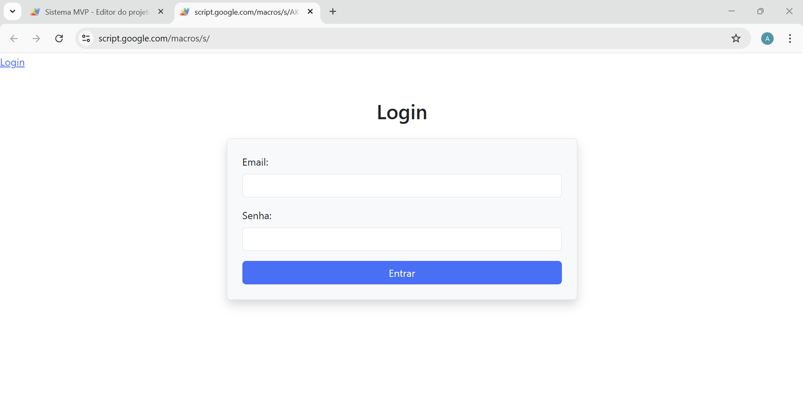

# 🧪 MVP sistema de automações (Antigo → Atual com React + Conceitos de Express JS)

Este projeto é um trecho de um MVP para validação, partindo de uma solução baseada em **jQuery + JavaScript antigo (ES5)** até uma abordagem moderna com **React** no frontend e uma arquitetura organizada no backend usando **Google Apps Script e Google Sheets como banco de dados**.

---

## 📸 Visão Geral

> Tela de login injetada diretamente por Google Apps Script, com dados armazenados em planilha Google Sheets.

---

## 📚 Objetivo

- Construir uma aplicação **(frontend + backend)** para integrar em um sistema mais antigo.
- Utilizar **Google Sheets como banco de dados** e **Apps Script como backend** customizado.
- Aplicar conceitos modernos de arquitetura backend (rotas, controllers, services, middlewares) mesmo fora de ambientes tradicionais como Node/Express.
- Desenvolver algo que tenha uma manutenção mais fácil e que possa ser reutilizados com diferentes usuários.

---

## 🛠 Tecnologias Utilizadas

### 🧩 Backend
- **Google Apps Script**
- **Planilha Google Sheets como banco de dados**
- **CLASP** para versionamento e desenvolvimento local
- **Triggers, e-mails e automações** com serviços nativos do Google (Gmail, Sheets etc.)
- **Lib criada do zero** simulando o comportamento do **Express** (roteamento, chain de middlewares, parse de requisições)
- Aplicação de conceitos como:
  - **JWT** para autenticação
  - **Camadas organizadas**: `routes`, `controllers`, `services`
  - **Model customizado** para manipulação estruturada da planilha como banco de dados

### 🎨 Frontend

#### Abordagem Antiga
- **JavaScript ES5** 
- **jQuery**
- Manipulação da DOM com `appendChild`

#### Abordagem Mais Moderna
- **React (via CDN)**
- **React Router (via CDN)**
- **Bootstrap (via CDN)** para estilização
- Uso de **hooks do React** (`useState`, `useEffect`, etc.) para controle de estado e efeitos
- Organização dos componentes e rotas simulando uma SPA

---

## 🔄 Integração com Google Sheets

Na fase inicial, a aplicação utiliza uma planilha do Google como banco de dados. A integração é feita via Apps Script com operações de leitura, escrita e autenticação de usuários.

Também foi usada a plataforma de automações do Google (como Gmail, triggers, etc.) para notificações e ações baseadas em eventos.

---

## 🧠 Conceitos Estudados

- Comparação entre abordagens legadas e modernas de desenvolvimento web
- Estruturação de backend mesmo fora de ambientes tradicionais, simulando Express
- Construção de uma **aplicação fullstack** com frontend e backend bem definidos
- Evolução progressiva de um frontend estático para React com roteamento e estado
- Integração de dados usando planilhas como banco e Apps Script como servidor
- Simulação de bundling, deploy e automações no ecossistema do Google
- Práticas modernas como uso de hooks, modularização e boas práticas de código
